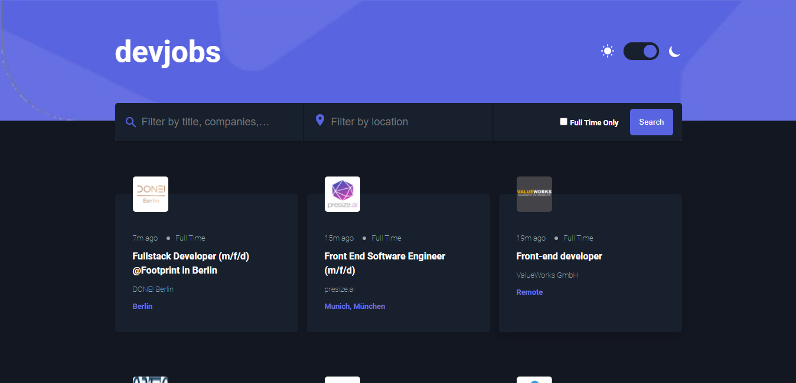

# GitHub Jobs

> A FrontEnd Mentors Challenge.

The project makes api calls to [GitHub Job](https://jobs.github.com/api)

## Built With

- HTML
- SCSS
- Javascript

## Live Demo

[Live Demo Link](https://chassecpts.github.io/github-jobs)

## Authors

👤 **Author1**

- GitHub: [@chasscepts](https://github.com/chasscepts)
- Twitter: [@ofChass](https://twitter.com/ofChass)
- LinkedIn: [LinkedIn](https://www.linkedin.com/in/francis-obetta-4033b71bb/)

## 🤝 Contributing

Contributions, issues, and feature requests are welcome!

Feel free to check the [issues page](https://github.com/chasscepts/github-jobs/issues)

## Show your support

Give a ⭐️ if you like this project!

## Acknowledgments

- [FrontEnd Mentors](https://www.frontendmentor.io)
- [GitHub Jobs](https://jobs.github.com)
- [Microverse Community](https://www.microverse.org/)
- Inspiration [#team-193-the-prowls](https://microverse-students.slack.com/archives/C01MLFX7919)
- Hat tip to anyone whose code was used

## 📝 License

This project is [MIT](https://github.com/chasscepts/github-jobs/blob/master/LICENSE) licensed.